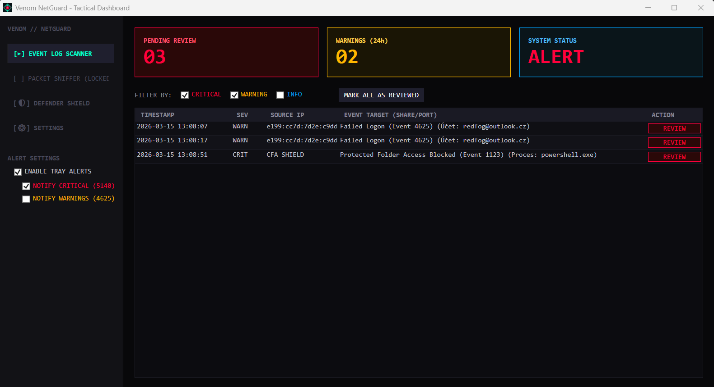
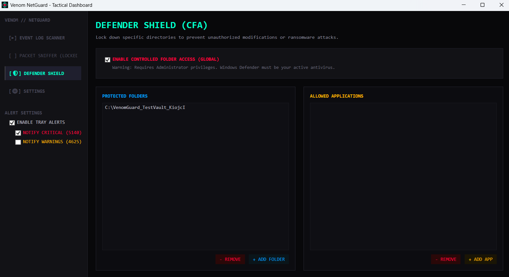

# 
       /\
    __//\\__
  /          \
 |  [ (O) ]  |
  \__      __/
     \\  //
      \//
       \/

# Venom NetGuard

**Venom NetGuard** is a tactical, lightweight Windows Security Event monitor. It provides passive, stealthy background monitoring of your local network interface and system defenses, triggering alerts only when specific threat thresholds are met.

## Overview
Unlike active firewalls, Venom NetGuard acts as a silent sentinel. It hooks directly into modern and legacy Windows Event Logs to detect unauthorized access attempts, network share anomalies, and ransomware-like behavior in real-time. It keeps you informed via a clean, distraction-free dashboard and intelligent tray notifications.

## Key Features
* **Passive Event Monitoring:** Listens silently to the `Security` and `Windows Defender/Operational` event logs without bogging down system resources.
* **Defender Shield (CFA Integration):** Manage Windows Defender Controlled Folder Access (CFA) directly from the UI. Easily whitelist applications or lock down sensitive directories to protect them against unauthorized modifications and ransomware payloads.
* **Targeted Threat Detection:** * Tracks Unauthorized Folder Access/Ransomware Blocks (`Event ID 1123/1124`) with automatic malicious process extraction.
  * Tracks Failed Logons (`Event ID 4625`) with full IPv6 & local loopback support and targeted account name extraction.
  * Tracks Network Share Access (`Event ID 5140`).
* **Stealth Auto-Start:** Uses Windows Task Scheduler to run seamlessly on boot with high privileges, bypassing annoying UAC prompts.
* **Alert Throttling:** Smart tray notifications prevent notification spam during automated attacks (e.g., port scans or rapid file enumerations).

## Screenshots

## Installation & Usage
1. Clone the repository and open `.sln` in Visual Studio.
2. Build the project.
3. **Important:** Run the application as an **Administrator**. 
   *(Admin privileges are strictly required to read Windows Security/Defender Logs, modify CFA policies, and register the auto-start task).*

## Notes for Developers
- The project uses `System.Text.Json` to save local user preferences. 
- Local settings and intercepted logs are saved to `nexus_data.json` (ignored in `.gitignore` to prevent leaking local data to the repository).
- Event Log monitoring utilizes both standard `EventLog` classes for legacy logs and a custom active polling mechanism (`DispatcherTimer` with `EventLogReader`) for modern Crimson logs to bypass native Windows event throttling.
- The `private/` directory is reserved for local, uncommitted experimental modules (e.g., future packet inspection tools).

## Disclaimer
This tool is built for educational purposes, personal network monitoring, and system administration. Always respect local laws and network policies.